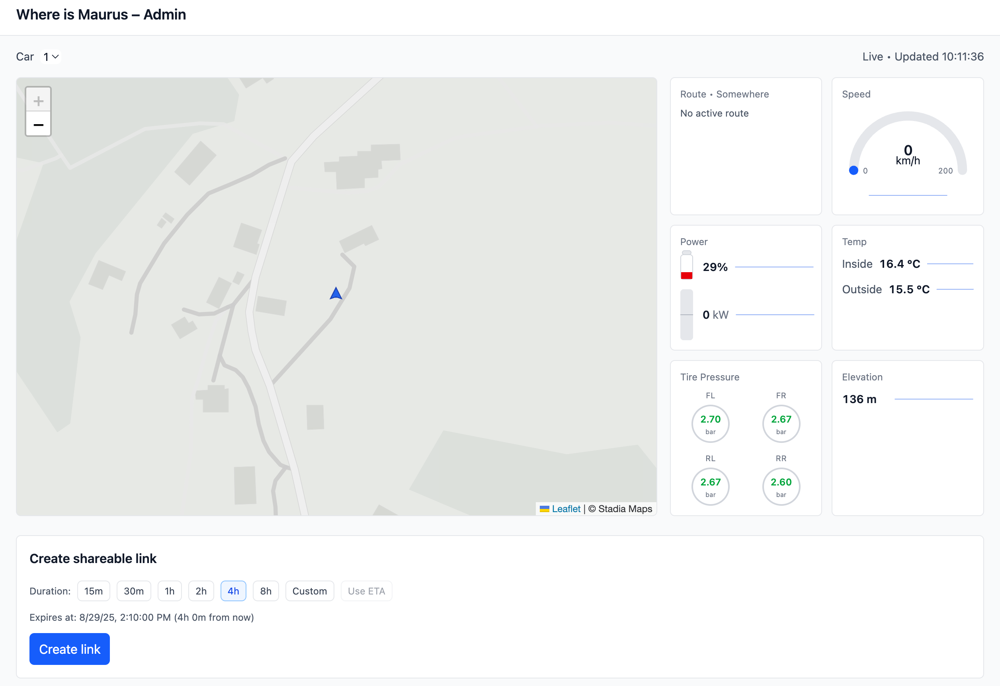

# Where is Maurus

[](https://www.gnu.org/licenses/agpl-3.0)

A real-time Tesla vehicle tracking application that provides live location, battery status, and other vehicle metrics through a web interface. The system consists of a Go backend that consumes TeslaMate MQTT data and a React frontend that displays the information in real-time.



## 🚗 What it does

- **Real-time tracking**: Monitor Tesla vehicle location, speed, battery level, and more
- **Live updates**: Server-Sent Events (SSE) provide instant updates without polling
- **Share functionality**: Generate shareable links for public viewing
- **Admin interface**: Protected admin panel for managing share tokens
- **TeslaMate integration**: Connects to TeslaMate MQTT broker for vehicle data

## 🏗️ Architecture

```
┌─────────────┐    MQTT     ┌─────────────┐    SSE      ┌─────────────┐
│ TeslaMate   │ ──────────→ │   Backend   │ ──────────→ │  Frontend   │
│   Broker    │             │   (Go)      │             │  (React)    │
└─────────────┘             └─────────────┘             └─────────────┘
                                   │
                                   │ HTTP API
                                   ▼
                            ┌─────────────┐
                            │   Admin     │
                            │  Interface  │
                            └─────────────┘
```

### Components

- **Backend** (`/backend`): Go service that consumes MQTT data and provides SSE streams
- **Frontend** (`/frontend`): Two React applications (Share + Admin) built with Vite
- **MQTT Integration**: Connects to TeslaMate MQTT broker for real-time vehicle data
- **Cloudflare Access**: Protects admin endpoints with JWT authentication

## 🚀 Quick Start

### Prerequisites

- Go 1.22+
- Node.js 18+
- MQTT broker (e.g., mosquitto) with TeslaMate integration
- TeslaMate instance with MQTT enabled

### 1. Backend Setup

```bash
cd backend
cp .env.example .env
# Edit .env with your MQTT broker details and Cloudflare config
make build
make run
```

### 2. Frontend Setup

```bash
cd frontend
cp .env.example .env
# Edit .env with your API base URLs
npm install
npm run dev:share   # Share UI at http://localhost:5173
npm run dev:admin   # Admin UI at http://localhost:5174
```

### 3. Access the Application

- **Share UI**: `http://localhost:5173` - Public interface for viewing vehicle status
- **Admin UI**: `http://localhost:5174` - Protected interface for managing shares
- **Backend API**: `http://localhost:8080` - Go service endpoints

## 📖 Documentation

- **[Backend README](backend/README.md)** - Detailed backend setup and configuration
- **[Frontend README](frontend/README.md)** - Frontend development and build instructions

## 🔧 Configuration

### Backend Environment Variables

Key configuration options in `backend/.env`:

```bash
HTTP_ADDR=:8080                       # HTTP server address
MQTT_BROKER_URL=tcp://localhost:1883  # MQTT broker URL
MQTT_USERNAME=                        # MQTT username (if required)
MQTT_PASSWORD=                        # MQTT password (if required)
CF_JWKS_URL=                          # Cloudflare JWT public keys
CF_ISSUER=                            # Cloudflare Access issuer
CF_AUDIENCE=                          # Cloudflare Access audience
```

### Frontend Environment Variables

Key configuration options in `frontend/.env`:

```bash
VITE_API_BASE_URL=https://api.example.com    # Backend API URL
VITE_SHARE_BASE_URL=https://share.example.com # Share UI base URL
```

## 🧪 Development

### Backend Development

```bash
cd backend
make run          # Run app
make test         # Run tests
make lint         # Run linter
make fmt          # Format code
```

### Frontend Development

```bash
cd frontend
npm run dev:share    # Development server for Share UI
npm run dev:admin    # Development server for Admin UI
npm run typecheck    # TypeScript type checking
npm run lint         # ESLint linting
npm run format       # Prettier formatting
```

## 🐳 Docker

### Backend

```bash
cd backend
make docker-build
make docker-run
```

## 📡 API Endpoints

- `GET /healthz` - Health check
- `POST /api/v1/session` - Create session from share token
- `GET /api/v1/stream` - SSE stream of vehicle data
- `POST /api/v1/shares` - Create share token (admin only)

## 🔒 Security

- Admin endpoints protected by Cloudflare Access JWT
- Share tokens are short-lived JWTs
- HttpOnly cookies for session management
- CORS configuration for allowed origins

## 🤝 Contributing

This project is licensed under the **GNU Affero General Public License v3.0 (AGPL-3.0)**. This means:

- ✅ You can use, modify, and distribute this software
- ✅ You can use it commercially
- ✅ You must share your modifications under the same license
- ✅ If you run a modified version on a server, you must provide the source code to users
- ✅ All derivative works must also be licensed under AGPL-3.0

### How to Contribute

1. Fork the repository
2. Create a feature branch
3. Make your changes
4. Run tests and linting
5. Submit a pull request

**Important**: By contributing to this project, you agree that your contributions will be licensed under the AGPL-3.0 license.

## 📄 License

This project is licensed under the **GNU Affero General Public License v3.0** - see the [LICENSE](LICENSE) file for details.

The AGPL-3.0 license ensures that:
- All modifications remain open source
- Network use is covered (important for web applications)
- Users have access to the source code of any modified version

---

**Note**: This application requires a TeslaMate instance with MQTT enabled to function. TeslaMate is a third-party Tesla data logger that provides the vehicle data via MQTT.
